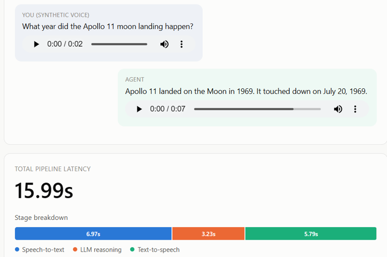

# Real-Time Local Voice Agent

A voice assistant that runs entirely on your own machine. Speech-to-text, an
LLM, and text-to-speech, all local: no API keys, no cloud calls, no
per-request cost. You ask it something, it transcribes you with
faster-whisper, sends the text to a small open-weight model running through
Ollama, and speaks the reply back with Kokoro TTS.

Why build this instead of just wiring up OpenAI's or ElevenLabs' APIs? A
couple of reasons. It's free to run as much as you want once the models are
downloaded, the audio never leaves the machine (which matters if you ever
want to use something like this for anything even mildly sensitive), and
frankly a real streaming voice pipeline is a fun systems problem that's easy
to get subtly wrong. The "naive pipeline" numbers below are what "wrong"
looks like.

## What's here right now

This is the baseline pipeline: record audio, transcribe, ask the LLM,
synthesize speech, play it back. Each stage runs to completion before the
next one starts. It's not fast, and it isn't meant to be yet. This is the
plumbing and model-selection layer, not the latency-optimized version. That
part's next, see Roadmap.

There's also a small local web UI (`src/webapp.py`) that runs the pipeline
against pre-recorded sample questions and shows the transcript, the reply,
and a stage-by-stage timing breakdown, so you don't have to read timing
numbers off a terminal to see what's slow.

## Stack, and why each piece

- **faster-whisper** (`small`, CPU, int8) for STT. Whisper is the default
  choice for open STT at this point. `small` felt like the right tradeoff:
  fast enough, and it leaves the GPU's VRAM free for the LLM instead of
  competing with it.
- **Qwen3 4B** via Ollama, specifically `qwen3:4b-instruct-2507-q4_K_M`. I
  started with the plain `qwen3:4b` tag first and hit something worth
  flagging: even with Ollama's `think: false` option set, that model still
  generated a full `<think>...</think>` reasoning block before the actual
  answer. The option just stops the trace from being shown; the tokens still
  get generated, so the latency cost is still there. Switched to the
  `-instruct-2507` tag, which is a genuinely non-thinking variant, and the
  overhead disappeared. Worth knowing if you're picking a Qwen3 model for
  anything where latency matters.
- **Kokoro** (82M params, int8 ONNX) for TTS. Surprising amount of quality for
  a model that small, and it runs fine on CPU, which keeps the GPU free for
  the model that actually needs it.
- Everything sized to run comfortably on an 8GB laptop GPU (tested on an
  RTX 5060 Laptop GPU), with peak VRAM usage during a full turn staying
  under 4GB.

## Does it work, and how slow is "slow"

It works. Transcription is accurate, the model answers correctly, TTS sounds
natural. Here's a real measured round trip on the hardware above, not a
rounded-up number:

| stage | typical time |
|---|---|
| STT (faster-whisper, ~2s of speech) | ~2.3s |
| LLM reply | ~4-7s (varies, see note below) |
| TTS synthesis | ~2.5-6s (depends on reply length) |
| **total, one turn** | **~10-15s** |

That's a bad number for something meant to feel like a conversation. It's
supposed to be, this is the naive version where nothing overlaps. One thing
worth knowing: Ollama unloads an idle model after a few minutes by default,
so the first request after a pause pays a full model-load cost (several
seconds) on top of generation time. Ask it something twice in a row and the
second answer comes back close to instantly, raw generation is usually well
under half a second. Most of the slowness above is stages waiting on each
other, not any one model being slow on its own.

*(Numbers above are on a quiet system; STT/TTS are CPU-bound so background load affects them.)*

## Demo



A synthetic sample question goes in, gets transcribed, answered by the local
LLM, and spoken back, with the stage timing breakdown shown live.

## Roadmap

The pipeline above is the foundation. The part that actually makes a voice
agent feel real-time isn't built yet:

- **Streaming STT to LLM to TTS.** Start synthesizing speech before the LLM
  has finished generating. Start the LLM on a stable partial transcript
  before the user's even finished talking. This is where most of the
  10-15 seconds above goes.
- **VAD-based turn-taking.** Right now it just records a fixed window. Real
  turn-taking means detecting when someone's actually done speaking instead
  of waiting out a timer.
- **Barge-in.** Interrupting the agent mid-sentence, which needs echo
  cancellation so the mic doesn't hear the agent's own voice come back
  through the speakers and mistake it for a new turn.
- A smaller-model comparison, to say something concrete about what this would
  take on a more constrained device than a laptop GPU.

## Setup

Windows, with an NVIDIA GPU (8GB+ VRAM recommended, it'll run CPU-only too,
just slower):

```
git clone https://github.com/sgupta2346/Real-Time-Local-Voice-Agent.git
cd Real-Time-Local-Voice-Agent
powershell -ExecutionPolicy Bypass -File scripts\setup.ps1
```

That installs Ollama, pulls the model (~2.5GB), downloads the Kokoro TTS
model files (~115MB), and sets up a Python venv with everything else. Model
weights never get committed to this repo, the setup script fetches them, so
cloning is small and fast even though running it isn't.

### Run it

```
cd src
..\.venv\Scripts\python.exe main.py --input ..\samples\sample_question_capital_of_france.wav
```

Or the web demo, which is the easier way to see it work:

```
..\.venv\Scripts\python.exe webapp.py
```

then open `http://127.0.0.1:5000`, pick a sample question, and hit run.

The `samples/` folder ships with a couple of pre-recorded test questions
(synthetic, TTS-generated, not a live mic recording) so you can try it
immediately without a working microphone.

### Tests

```
..\.venv\Scripts\python.exe -m pip install -r requirements-dev.txt
..\.venv\Scripts\python.exe -m pytest tests/
```

These are integration tests, not unit tests. They hit the real local Whisper
model, the real Ollama server, and the real Kokoro model, so Ollama needs to
be running and the model needs to be pulled first.

## License

MIT, see `LICENSE`.
